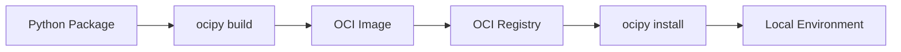

# ocipy: OCI Python Packaging Tool

**Distribute Python packages using OCI registries with ease**

`ocipy` enables you to publish and install Python packages using [OCI (Open Container Initiative) registries](https://opencontainers.org/). Leverage your existing OCI infrastructure for secure, versioned Python package distribution without complex PyPI proxy setups.

## ✨ Key Features

!!! tip "Why Choose ocipy?"
    - **🚀 Simple CLI** - Intuitive commands for publishing and installing packages
    - **🔒 Secure Distribution** - Leverage OCI registry security features
    - **📦 Version Management** - Built-in versioning and tagging support
    - **🏗️ Build System Integration** - Works seamlessly with your existing workflow
    - **🌐 Registry Flexibility** - Use any OCI-compliant registry

## Quick Start

### Installation

Install ocipy using pip:

```bash
pip install ocipy
```

Or add it to your `pyproject.toml` for build system integration:

```toml
[build-system]
requires = ["ocipy"]
```

### Publishing Your First Package

```bash
# Configure your registry
ocipy config set-registry oci://registry.example.com/my-packages

# Publish your package
ocipy publish --tag latest
```

### Installing Packages

```bash
# Install from OCI registry
ocipy install my-package

# Install specific version
ocipy install my-package:v1.2.3
```

## How It Works



ocipy transforms your Python packages into OCI-compliant artifacts, enabling you to:

1. **Build** packages as OCI images with proper metadata
2. **Push** to any OCI registry (Docker Hub, AWS ECR, Azure ACR, etc.)
3. **Pull** and install packages from registries
4. **Manage** versions using OCI tags and manifests

## Getting Started

!!! info "Documentation Versioning"
    This documentation uses [Mike](https://github.com/jimporter/mike) for version management. You can switch between different versions of the documentation using the version selector in the navigation bar. Each version corresponds to a specific release of ocipy.

<div class="md-typeset">
  <div class="md-button-group">
    <a href="getting-started/installation/" class="md-button md-button--primary">
      🚀 Installation Guide
    </a>
    <a href="getting-started/quickstart/" class="md-button">
      📖 Quick Start Tutorial
    </a>
    <a href="user-guide/publishing/" class="md-button">
      📦 Publishing Guide
    </a>
  </div>
</div>

## Community & Support

- **GitHub**: [Report issues and contribute](https://github.com/your-username/ocipy)
- **Documentation**: Comprehensive guides and API reference
- **Examples**: Real-world usage patterns and best practices

---

!!! info "About OCI"
    The [Open Container Initiative (OCI)](https://opencontainers.org/) is an open governance structure for creating open industry standards around container formats and runtimes. By using OCI registries for Python packages, you get enterprise-grade security, scalability, and tooling.
